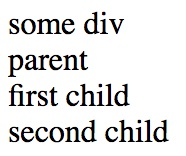

AngularJS1 Directive Execution Log Demo
=======================================

Define a directive to track execution of directives, in [AngularJS1](https://angularjs.org/).

The code is copied from https://stackoverflow.com/a/24615162/342235

```
npm install
open index.html
```



Traps in the code
-----------------

### `app.directive('helloTo'`

The directive name must be camelCases, e.g. `helloTo`

If you use other formats, e.g. `hello-to`, it will be ignored, silently.

### `$element` is instance of JQLite

See: https://docs.angularjs.org/api/ng/function/angular.element#angularjs-s-jqlite

### The api is quite complex

Just see <https://docs.angularjs.org/api/ng/service/$compile#directive-definition-object>.

Resources
---------

- directive api: https://docs.angularjs.org/api/ng/service/$compile#directive-definition-object
- $element api: https://docs.angularjs.org/api/ng/function/angular.element#angularjs-s-jqlite